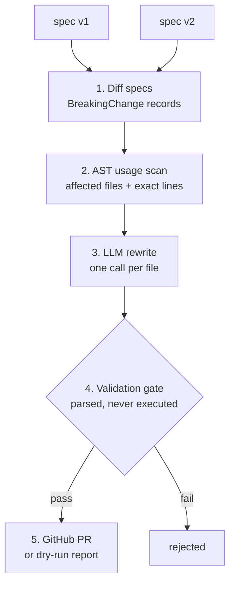

<div align="center">

# 🩹 Self-Healing API Integration Agent

**Your API changed. Your code didn't. This agent closes the gap — automatically.**

[](https://github.com/codingwinterz/self-healing-api-agent/actions/workflows/ci.yml)


</div>

---

An autonomous agent that watches a third-party API for breaking changes, finds **every place in a codebase** the change would bite, and opens a **ready-to-review pull request** with the fix.

Existing tools like Dependabot and Renovate bump package version numbers. They don't detect or fix the actual logic that breaks when an API's behavior changes underneath a pinned dependency — a renamed response field read in four places, a parameter that silently became required. **This agent does.**

## 🎬 What a run looks like

```text
$ python -m agent.main --spec-v1 stripe_spec_v1.json \
      --spec-v2 stripe_spec_v2.json --repo sample_repo

Detected 4 breaking change(s):
  - Response field 'amount' was renamed to 'amount_due' in schema Charge.
  - Response field 'status' was renamed to 'payment_status' in schema Charge.
  - Response field 'captured' was removed from schema Charge.
  - Request parameter 'email' is now required for POST /v1/customers.

Found 6 affected usage(s) across 1 file(s); 0 file(s) patched.
Dry-run report: output/pr_report.md
```

That last line is a full markdown report: every breaking change, every affected line of *your* code with snippets, and the proposed fix — ready for `--fix` to turn into real patches and a PR.

## 📊 Results

Offline evaluation across two seeded changesets (10 breaking changes total), scored by a script that **re-scans the patched output** — not by eyeballing:

| Verdict | Count | Which changes |
|---|---|---|
| ✅ Resolved automatically | **7/10** | All renames, all newly-required params |
| 🙋 Escalated to human | **3/10** | Removed response fields — no mechanical fix exists |
| 🚫 Invalid patches | **0** | Every proposed patch passed the validation gate |

> **The escalations are the feature, not the gap.** When a response field disappears, the *right* fix depends on business intent — so the agent flags it for a human instead of guessing. Reproduce: `python eval/run_eval.py`.

## ⚙️ How it works



| # | Stage | Module | What it does |
|---|---|---|---|
| 1 | **Change detection** | `agent/diff_spec.py` | Diffs two OpenAPI specs. Renames are paired by fuzzy matching, so `status → payment_status` is a *rename* (obvious fix), not a removal. |
| 2 | **Usage scanning** | `agent/scan_repo.py` | Parses your repo with Python's `ast` — finds `charge["status"]`, `charge.get("status")`, `charge.status`, and `.create()` calls missing new required params, with exact line numbers. |
| 3 | **Fix generation** | `agent/generate_fix.py` | One LLM call per affected file, with the structured change data and found usages. Provider is injected — see [Providers](#-llm-providers). |
| 4 | **Validation gate** | `agent/validate.py` | Generated code is *parsed*, never executed. Doesn't parse, doesn't change anything, or deletes public functions → rejected before a PR. |
| 5 | **Delivery** | `agent/open_pr.py` | Dry-run markdown report locally, or a real GitHub PR with the full diagnosis. |

## 🚀 Quick start

Requires **Python 3.10+**. No API keys needed for steps 1–3.

```bash
git clone https://github.com/codingwinterz/self-healing-api-agent
cd self-healing-api-agent
pip install -r requirements.txt

python -m pytest tests/ -v          # 1. test suite
python -m agent.main \
    --spec-v1 fixtures/stripe_spec_v1.json \
    --spec-v2 fixtures/stripe_spec_v2.json \
    --repo fixtures/sample_repo     # 2. dry run → output/pr_report.md
python eval/run_eval.py             # 3. offline benchmark (7/10, no keys)
```

<details>
<summary><b>Real LLM patches & GitHub PRs</b> (click to expand)</summary>

```bash
# 4. Full run with real LLM patches
export ANTHROPIC_API_KEY=sk-ant-...        # or XAI_API_KEY with --provider grok
python -m agent.main --spec-v1 ... --spec-v2 ... --repo ... --fix

# 5. Open a real pull request (also needs GITHUB_TOKEN)
python -m agent.main ... --fix --pr owner/repo
```

`fixtures/` contains two seeded changesets — spec versions before/after plus sample repos whose code each change breaks — so the whole pipeline demos deterministically, with no waiting on real-world API drift.

</details>

## 🔑 LLM Providers

The patch-writer is pluggable — the client is a plain injected function, so any provider that returns text works:

| Provider | Flag | Key | Default model |
|---|---|---|---|
| Anthropic | `--provider anthropic` *(default)* | `ANTHROPIC_API_KEY` | `claude-sonnet-4-5` |
| Grok (xAI) | `--provider grok` | `XAI_API_KEY` | `grok-4-fast` |

> The agent **never needs keys for the API it watches** — it diffs published spec files, not live endpoints. Your Stripe/OpenAI/Grok keys stay out of this entirely.

## 🤔 Why not just Dependabot?

| | Dependabot / Renovate | 🩹 This agent |
|---|---|---|
| Dependency version bumps | ✅ | ➖ out of scope |
| Renamed response field read in 4 files | ❌ | ✅ patches all 4 |
| Param silently became required | ❌ | ✅ adds it to every call |
| Removed field (needs judgment) | ❌ | 🙋 escalates to you |
| How you find out | changelog | **before the incident** |

Dependabot handles the case where the *dependency* changes. This handles the case where the dependency is pinned and the **service behind it** changes — which is exactly when teams find out from a production incident instead of a changelog.

## 🧭 Roadmap

- [ ] Fetch provider specs on a schedule (no manual snapshots)
- [ ] Scanners beyond Python (tree-sitter)
- [ ] Run the target repo's own tests as a second validation gate
- [ ] Cross-file refactors (shared types)

## ⚠️ Honest limitations

- **Name-based matching** can over-report: a same-named field in an unrelated context gets flagged. Deliberate trade-off — the report shows snippets, so a human filters false positives in seconds.
- **Single file at a time**: patches are per-file; cross-file refactors are future work.
- **Python repos only** (v1) — the AST scanner is CPython's `ast`; other languages need language-specific scanners.
- **Removals escalate, they don't guess** — by design.

## 📄 License

[MIT](LICENSE) — use it, fork it, ship it.

---

<div align="center">

**If a breaking API change ever woke you up at 3 AM, you know why this exists.** ⭐

</div>
